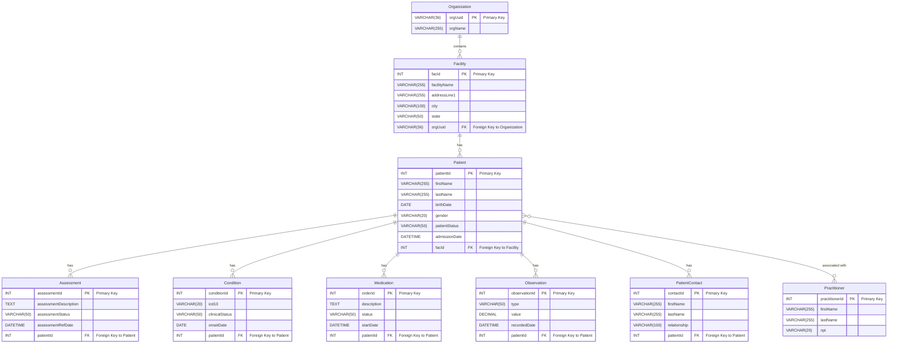

This diagram is derived from the relationships and data structures defined in the `components/schemas` section of the API specification. Relationships are inferred from properties that reference other entities (e.g., a `patientId` field in an `Assessment` object implies a relationship to a `Patient` object).

---

### Core Entities and Relationships

Here are the primary entities and how they relate to one another.

#### **1. Organization**

The top-level entity that contains facilities and patients. It's referenced in almost every API call via `orgUuid`.

- **Attributes:**
  - `orgUuid` (string, Primary Key)
  - `orgName` (string)
- **Relationships:**
  - **Has Many → Facilities:** An Organization contains multiple facilities.
  - **Has Many → Patients:** Through its facilities, an organization has a roster of all patients.

---

#### **2. Facility**

Represents a physical location within an Organization where care is provided.

- **Attributes:**
  - `facId` (integer, Primary Key)
  - `facilityName` (string)
  - `addressLine1`, `city`, `state`, `postalCode` (string)
  - `timeZone` (string)
  - `bedCount` (integer)
- **Relationships:**
  - **Belongs to → Organization:** Each Facility is part of one Organization.
  - **Has Many → Patients:** A facility has a list of current and past patients.
  - **Has Many → Rooms, Beds, Units, Floors:** A facility is composed of physical locations.

---

#### **3. Patient**

The central entity representing an individual receiving care. Most clinical data is linked to the patient.

- **Attributes:**
  - `patientId` (integer, Primary Key)
  - `firstName`, `lastName` (string)
  - `birthDate` (date)
  - `gender` (string)
  - `admissionDate` (datetime)
  - `dischargeDate` (datetime)
  - `patientStatus` (string)
  - `medicalRecordNumber` (string)
- **Relationships:**
  - **Belongs to → Facility:** A patient's stay is associated with a specific facility.
  - **Has Many → Clinical Records:** A single patient record is linked to numerous clinical data entities, including:
    - **Assessments:** Clinical evaluations performed on the patient.
    - **Conditions:** Diagnoses and health problems.
    - **AllergyIntolerances:** A list of the patient's allergies.
    - **Medications:** A list of prescribed medications.
    - **Observations:** Vital signs and other clinical measurements.
    - **ProgressNotes:** Notes written by care staff.
    - **Immunizations:** A record of vaccinations.
    - **ADTRecords:** Admission, Discharge, and Transfer history.
  - **Has Many → Administrative Records:**
    - **PatientContacts:** A list of contacts (e.g., family, guardian).
    - **Coverages:** Insurance and payer information.
    - **Practitioners:** A list of associated medical professionals.

---

### Clinical and Administrative Entities

These entities represent the detailed records associated with a `Patient`.

#### **4. Assessment**

Represents a clinical assessment performed for a patient.

- **Attributes:**
  - `assessmentId` (integer, Primary Key)
  - `assessmentDescription` (string)
  - `assessmentStatus` (string)
  - `assessmentRefDate` (datetime)
- **Relationships:**
  - **Belongs to → Patient:** Each assessment is for a specific patient (`patientId`).

---

#### **5. Condition**

Represents a patient's diagnosis or health condition.

- **Attributes:**
  - `conditionId` (integer, Primary Key)
  - `icd10`, `icd10Description` (string)
  - `clinicalStatus` (string: "ACTIVE", "RESOLVED")
  - `onsetDate` (date)
- **Relationships:**
  - **Belongs to → Patient:** Each condition is linked to a specific patient (`patientId`).

---

#### **6. Medication**

Represents a medication order for a patient.

- **Attributes:**
  - `orderId` (integer, Primary Key)
  - `description` (string)
  - `generic` (string)
  - `status` (string: "ACTIVE", "DISCONTINUED")
  - `startDate`, `endDate` (datetime)
- **Relationships:**
  - **Belongs to → Patient:** Each medication is prescribed to a specific patient (`clientId`).

---

#### **7. Observation**

Represents a specific clinical measurement, like a vital sign.

- **Attributes:**
  - `observationId` (integer, Primary Key)
  - `type` (string: "bloodPressure", "weight", "temperature")
  - `value` (number)
  - `systolicValue`, `diastolicValue` (number)
  - `unit` (string)
  - `recordedDate` (datetime)
- **Relationships:**
  - **Belongs to → Patient:** Each observation is recorded for a specific patient (`patientId`).

